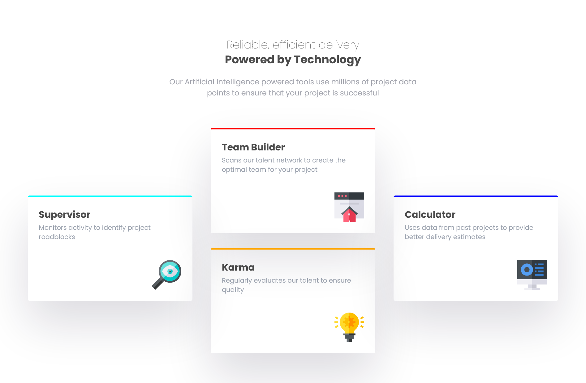
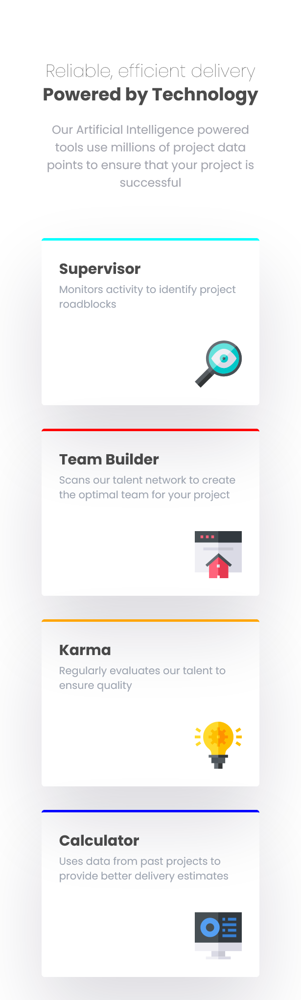

# Frontend Mentor - Four card feature section solution

This is a solution to the [Four card feature section challenge on Frontend Mentor](https://www.frontendmentor.io/challenges/four-card-feature-section-weK1eFYK). Frontend Mentor challenges help you improve your coding skills by building realistic projects.

## Table of contents

- [Overview](#overview)
  - [The challenge](#the-challenge)
  - [Screenshot](#screenshot)
  - [Links](#links)
- [My process](#my-process)
  - [Built with](#built-with)
- [Author](#author)

## Overview

### The challenge

Users should be able to:

- View the optimal layout for the site depending on their device's screen size

### Screenshot

### Links

- Solution URL: [Github Repo](https://github.com/hamz-aa/frontend-mentor-challenges/tree/main/four-card-feature-section-master)

## My Process

### Built with

- Mobile-first workflow
- React.js
- Tailwind CSS
- Responsive Design

## Author

- Frontend Mentor - [@hamz-aa](https://www.frontendmentor.io/profile/hamz-aa)
- Github - [@hamz-aa](https://github.com/hamz-aa)
